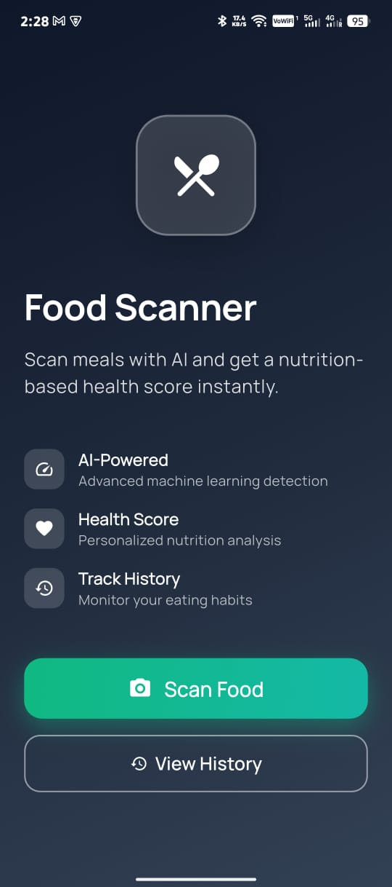
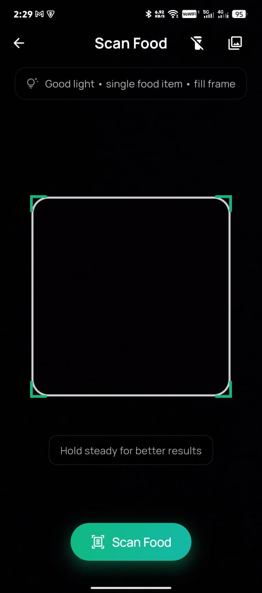
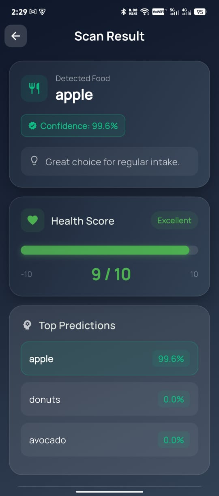
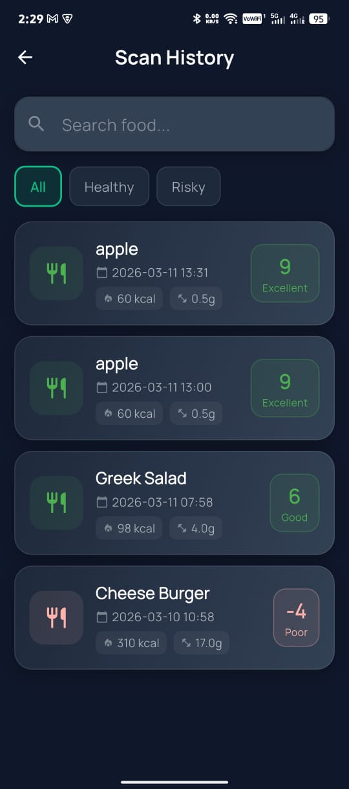

# Food Scanner

<p align="center">
  
  
  
</p>

AI-powered food scanner application built with Flutter that analyzes food images using machine learning and provides instant nutritional information and health scores.

## Features

### 🤖 AI-Powered Detection
- Real-time food image classification using TensorFlow Lite
- Supports **101 food categories** including fruits, vegetables, meats, desserts, and beverages
- Confidence-based prediction with top 3 suggestions
- Offline inference - works without internet connection

### 📊 Health Score System
- Intelligent health scoring algorithm based on nutritional parameters
- Visual health meter with color-coded indicators (Green/Orange/Red)
- Personalized recommendations based on nutritional profile
- Warning alerts for high-risk ingredients

### 🍎 Nutritional Analysis
- Detailed breakdown of nutritional content:
  - Calories
  - Sugar
  - Fat & Saturated Fat
  - Protein
  - Fiber
  - Sodium
- Per-serving information display

### 📱 Modern UI/UX
- Beautiful gradient-based design
- Smooth animations and transitions
- Dark and Light theme support
- Camera with flashlight toggle
- Gallery image selection
- Scan history tracking

## Screenshots

| Home Screen | Scan Screen | Result Screen | History Screen |
|-------------|-------------|---------------|----------------|
|  |  |  |  |


## Supported Food Categories

The model can recognize **101 food items** including:

| Category | Examples |
|----------|----------|
| **Fruits** | Apple, Banana, Orange, Mango, Strawberry, Blueberry, Grape, Watermelon, Kiwi, Peach, Cherry, Pear, Pomegranate, Avocado |
| **Vegetables** | Broccoli, Carrot, Cucumber, Lettuce, Spinach, Tomato, Potato, Onion, Pepper, Mushroom, Corn, Cabbage, Cauliflower |
| **Proteins** | Chicken Breast, Steak, Beef, Fish, Eggs, Lamb Chops, Meatball |
| **Fast Food** | Hamburger, Pizza, Hot Dog, French Fries, Sandwich, Club Sandwich, Chicken Burger |
| **Desserts** | Chocolate Cake, Ice Cream, Cheesecake, Brownie, Donuts, Cup Cakes, Muffin, Croissant |
| **Beverages** | Tea, Coffee, Smoothie Bowl, Yogurt, Frozen Yogurt |
| **Grains & Carbs** | Rice, Bread, Toast, Pancakes, Pasta, Noodles, Porridge |
| **Traditional Dishes** | Samosa, Falafel, Dumplings, Spring Rolls, Curry, Biryani |

## Architecture

```
lib/
├── core/                    # Core utilities and configuration
│   ├── app_routes.dart       # Navigation routes
│   └── app_theme.dart       # Theme configuration
├── models/                  # Data models
│   ├── ai_detection_result.dart
│   ├── food_profile.dart
│   ├── food_scan_result.dart
│   └── nutrition_data.dart
├── repositories/            # Data repositories
│   └── food_repository.dart
├── screens/                 # App screens
│   ├── home_screen.dart
│   ├── scan_screen.dart
│   ├── result_screen.dart
│   ├── history_screen.dart
│   └── viewmodels/          # Screen state management
├── services/               # Business logic services
│   ├── food_ai_service.dart      # TensorFlow Lite inference
│   ├── nutrition_service.dart    # Nutrition data lookup
│   ├── image_preprocessing_service.dart
│   ├── model_config.dart
│   └── storage_service.dart      # Local storage (Hive)
├── utils/                  # Utility functions
│   ├── formatters.dart
│   ├── health_score_calculator.dart
│   └── example_data.dart
└── widgets/                # Reusable UI components
    ├── scan_button.dart
    ├── scan_overlay.dart
    ├── health_score_meter.dart
    ├── nutrition_card.dart
    ├── food_card.dart
    └── result_summary.dart
```

## Technology Stack

| Component | Technology |
|-----------|------------|
| **Framework** | Flutter 3.11.1 |
| **Language** | Dart |
| **ML Runtime** | TensorFlow Lite (tflite_flutter) |
| **State Management** | Provider |
| **Local Storage** | Hive |
| **Camera** | camera |
| **Image Picker** | image_picker |
| **UI** | Material Design 3, Lottie Animations |

## Getting Started

### Prerequisites

- Flutter SDK 3.11.1 or higher
- Dart SDK 3.11.1 or higher
- Android SDK (for Android builds)
- Xcode (for iOS/macOS builds)

### Installation

1. **Clone the repository**
   ```bash
   git clone <repository-url>
   cd food-scanner
   ```

2. **Install dependencies**
   ```bash
   flutter pub get
   ```

3. **Run the app**
   ```bash
   flutter run
   ```

### Building for Release

**Android (APK)**
```bash
flutter build apk --release
```

**iOS**
```bash
flutter build ios --release
```

**Windows**
```bash
flutter build windows --release
```

**Linux**
```bash
flutter build linux --release
```

**macOS**
```bash
flutter build macos --release
```

## Usage

### Scanning Food

1. Launch the app and tap **"Scan Food"** button
2. Point your camera at the food item
3. Tap the **scan button** to capture
4. View the AI detection results and health score

### Using Gallery

1. Tap the **gallery icon** in the scan screen
2. Select an image from your device
3. View the analysis results

### Viewing History

1. Tap **"View History"** on the home screen
2. Browse through previously scanned items
3. Tap any item to view detailed results

## Data Sources

- **Food Classification Model**: Custom TensorFlow Lite model trained on food images
- **Nutrition Data**: Local JSON database (`assets/data/food_database.json`) with nutritional information for each food item

## Health Score Algorithm

The health score is calculated based on the following nutritional factors:

| Factor | Threshold | Points |
|--------|-----------|--------|
| Sugar | > 20g per serving | -3 |
| Saturated Fat | > 5g per serving | -3 |
| Sodium | > 500mg per serving | -2 |
| Fiber | > 4g per serving | +2 |
| Protein | > 8g per serving | +2 |

Score ranges:
- **7-10**: 🟢 Excellent - Great choice for regular intake
- **1-6**: 🟢 Good - Decent choice, keep portions balanced
- **-3 to 0**: 🟠 Moderate - Limit frequency of consumption
- **-10 to -4**: 🔴 Low - Prefer healthier alternatives

## Configuration

### Adding New Food Items

Edit `assets/data/food_database.json` to add new food items:

```json
{
  "foods": [
    {
      "label": "food_name",
      "healthScore": 5,
      "nutrition": {
        "calories": 100,
        "sugar": 5,
        "fat": 3,
        "saturatedFat": 1,
        "protein": 5,
        "fiber": 2,
        "sodium": 0.1
      },
      "avoidFor": ["Allergy information"]
    }
  ]
}
```

### Model Configuration

The TensorFlow Lite model is located at `assets/models/food_classifier.tflite`. Labels are defined in `assets/models/labels.txt`.

## Contributing

Contributions are welcome! Please feel free to submit a Pull Request.

1. Fork the repository
2. Create your feature branch (`git checkout -b feature/amazing-feature`)
3. Commit your changes (`git commit -m 'Add some amazing feature'`)
4. Push to the branch (`git push origin feature/amazing-feature`)
5. Open a Pull Request

## License

This project is licensed under the MIT License - see the [LICENSE](LICENSE) file for details.

## Acknowledgments

- [TensorFlow Lite](https://www.tensorflow.org/lite) for on-device ML
- [Flutter](https://flutter.dev) for the cross-platform framework
- [OpenFoodFacts](https://world.openfoodfacts.org/) for nutrition data inspiration

---

<p align="center">Made with ❤️ using Flutter</p>

